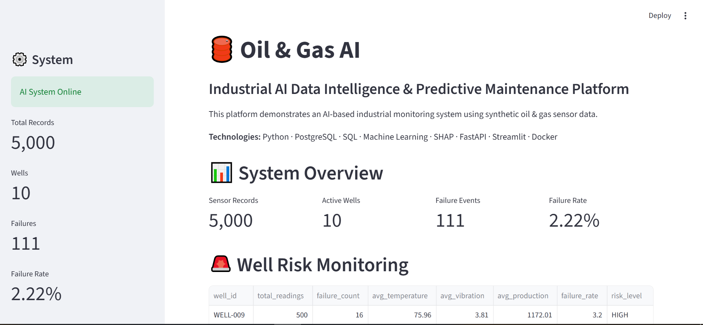

# 🛢️ Oil & Gas AI

## Industrial AI Data Intelligence & Predictive Maintenance Platform

An end-to-end Industrial AI platform designed to demonstrate how industrial sensor data can be collected, cleaned, stored, analyzed, and transformed into explainable equipment failure-risk predictions.

The platform combines **Data Engineering, PostgreSQL, SQL Analytics, Machine Learning, Explainable AI, FastAPI, Streamlit, and Docker** in a single integrated system.

> **Important:** This project uses **synthetic industrial sensor data** created for demonstration and portfolio purposes. It does not contain proprietary or confidential data from Sonatrach, SLB, Halliburton, or any other company.

---

## 🚀 Project Overview

Industrial equipment continuously generates large amounts of sensor data such as:

* Pressure
* Temperature
* Vibration
* Flow rate
* Production rate
* Pump speed

The goal of this project is to demonstrate an AI-driven workflow that can transform these measurements into useful operational insights.

The system provides:

* Automated data ingestion and cleaning
* PostgreSQL data storage
* SQL-based well intelligence
* Machine Learning failure-risk prediction
* Probability-based risk classification
* SHAP-based explainability
* REST API using FastAPI
* Interactive monitoring dashboard using Streamlit
* Containerized deployment using Docker Compose

---

# 🏗️ System Architecture

```text
                 ┌─────────────────────────────┐
                 │ Synthetic Industrial Data   │
                 │                             │
                 │ Pressure                    │
                 │ Temperature                 │
                 │ Vibration                   │
                 │ Flow Rate                   │
                 │ Production Rate             │
                 │ Pump Speed                  │
                 └──────────────┬──────────────┘
                                │
                                ▼
                 ┌─────────────────────────────┐
                 │ Python ETL Pipeline         │
                 │                             │
                 │ Data Loading                │
                 │ Cleaning                    │
                 │ Validation                  │
                 │ Transformation              │
                 └──────────────┬──────────────┘
                                │
                                ▼
                 ┌─────────────────────────────┐
                 │ PostgreSQL                  │
                 │                             │
                 │ industrial_sensor_data      │
                 │                             │
                 │ 5,000 records               │
                 │ 10 wells                    │
                 └──────────────┬──────────────┘
                                │
                  ┌─────────────┴─────────────┐
                  │                           │
                  ▼                           ▼
       ┌─────────────────────┐    ┌─────────────────────┐
       │ SQL Analytics       │    │ Machine Learning    │
       │                     │    │                     │
       │ Well Statistics     │    │ Failure Prediction  │
       │ Failure Rates       │    │ Probability         │
       │ Risk Classification │    │ Risk Level          │
       └──────────┬──────────┘    └──────────┬──────────┘
                  │                          │
                  │                          ▼
                  │                ┌─────────────────────┐
                  │                │ SHAP                │
                  │                │ Explainable AI      │
                  │                │                     │
                  │                │ Feature Importance  │
                  │                │ Prediction Drivers  │
                  │                └──────────┬──────────┘
                  │                           │
                  └─────────────┬─────────────┘
                                ▼
                 ┌─────────────────────────────┐
                 │ FastAPI REST API            │
                 │                             │
                 │ /health                     │
                 │ /wells                      │
                 │ /predict                    │
                 └──────────────┬──────────────┘
                                │
                                ▼
                 ┌─────────────────────────────┐
                 │ Streamlit Dashboard         │
                 │                             │
                 │ System Overview             │
                 │ Well Risk Monitoring        │
                 │ Sensor Analytics            │
                 │ Failure Prediction          │
                 │ SHAP Explainability         │
                 │ Time-Series Monitoring      │
                 │ PostgreSQL Intelligence     │
                 └─────────────────────────────┘

                 Docker / Docker Compose
```

---

# 🎯 Objectives

The project was developed to demonstrate an end-to-end Industrial AI workflow rather than only a standalone Machine Learning model.

### Main objectives

1. Build an industrial-style data pipeline.
2. Store and query sensor data using PostgreSQL.
3. Perform operational analytics using SQL.
4. Train a Machine Learning model for failure-risk prediction.
5. Explain model predictions using SHAP.
6. Expose AI capabilities through a REST API.
7. Build an interactive monitoring dashboard.
8. Containerize the complete application using Docker.

---

# 🧰 Technologies

| Technology     | Purpose                       |
| -------------- | ----------------------------- |
| Python 3.11    | Core programming language     |
| Pandas         | Data processing               |
| NumPy          | Numerical computing           |
| Scikit-learn   | Machine Learning              |
| SHAP           | Explainable AI                |
| PostgreSQL 18  | Database                      |
| SQLAlchemy     | Database integration          |
| psycopg2       | PostgreSQL driver             |
| FastAPI        | REST API                      |
| Pydantic       | API data validation           |
| Streamlit      | Interactive dashboard         |
| Requests       | API communication             |
| Matplotlib     | Visualization                 |
| Docker         | Containerization              |
| Docker Compose | Multi-container orchestration |
| Git / GitHub   | Version control and portfolio |

---

# 📊 Dataset

The project uses a synthetic industrial sensor dataset generated specifically for this project.

### Dataset characteristics

* **5,000 records**
* **10 wells**
* **10 industrial sensor/data features**
* Hourly timestamps
* Failure classification target

### Main fields

```text
timestamp
well_id
equipment_id
pressure_bar
temperature_c
vibration_mm_s
flow_rate_bbl_day
production_rate_bbl_day
pump_speed_rpm
failure
```

### Failure distribution

```text
Normal   : 4,889
Failure  :   111
Total    : 5,000
```

Approximate distribution:

```text
Normal   = 97.78%
Failure  = 2.22%
```

The abnormal patterns in the dataset are generated synthetically to simulate industrial operating conditions.

They should **not** be interpreted as real field thresholds or safety limits.

---

# 🔄 Data Engineering / ETL Pipeline

The ETL pipeline is responsible for moving raw CSV data into PostgreSQL.

### Pipeline

```text
CSV
 ↓
Load
 ↓
Column normalization
 ↓
Data validation
 ↓
Missing / invalid data handling
 ↓
Type conversion
 ↓
PostgreSQL insertion
 ↓
Verification
```

### ETL script

```text
src/ingestion/load_to_postgres.py
```

The pipeline:

* Reads the raw CSV file
* Normalizes column names
* Ensures required columns exist
* Converts timestamps
* Converts numeric sensor columns
* Removes invalid rows
* Connects to PostgreSQL
* Loads the cleaned data
* Verifies the inserted row count

### Example result

```text
CSV loaded successfully.
Rows: 5000

Removed invalid rows: 0
Rows after cleaning: 5000

PostgreSQL connection successful!

Records inserted: 5000
Table: industrial_sensor_data
Database: oil_gas_ai
```

---

# 🗄️ PostgreSQL

The project uses PostgreSQL as the central storage layer for industrial sensor data and analytics.

### Database

```text
Database: oil_gas_ai
Table: industrial_sensor_data
```

### Stored information

```text
id
well_id
equipment
timestamp
pressure_bar
temperature_c
vibration_mm_s
flow_rate_bbl_day
production_rate_bbl_day
pump_speed_rpm
failure
```

### Example SQL analytics

The project performs well-level analytics such as:

* Total readings
* Failure count
* Failure rate
* Average temperature
* Average vibration
* Average production
* Risk classification

Example conceptual output:

```text
WELL-009
Readings: 500
Failures: 16
Failure Rate: 3.20%
Risk: HIGH_RISK
```

The risk categories used in this project are **project-defined thresholds for synthetic data**, not real industrial safety standards.

---

# 🤖 Machine Learning

The project uses a classification model to estimate failure risk from sensor measurements.

### Model

```text
Logistic Regression
```

### Input features

```python
[
    "pressure_bar",
    "temperature_c",
    "vibration_mm_s",
    "flow_rate_bbl_day",
    "production_rate_bbl_day",
    "pump_speed_rpm"
]
```

### Preprocessing

The sensor features are standardized using:

```text
StandardScaler
```

### Training workflow

```text
Raw Data
   ↓
Feature Selection
   ↓
Train / Test Split
   ↓
StandardScaler
   ↓
Logistic Regression
   ↓
Prediction
   ↓
Probability
   ↓
Risk Level
```

---

# 📈 Model Evaluation

On the synthetic test dataset, the current model produced:

```text
Accuracy: 99.90%
```

Confusion matrix:

```text
[[977   1]
 [  0  22]]
```

For the synthetic **Failure** class:

```text
Precision: approximately 96%
Recall:    100%
F1-score:  approximately 98%
```

### Important interpretation

These results demonstrate that the current implementation works effectively on the generated dataset.

However, these metrics **must not be interpreted as real-world oil-field predictive performance**.

The dataset is synthetic and the generation rules strongly influence the observed patterns.

For a production-grade industrial ML system, additional validation would be required, such as:

* Time-based validation
* Well-wise validation
* Independent field data
* Sensor drift analysis
* Class imbalance strategies
* External validation
* Model monitoring
* False-alarm analysis

---

# 🔍 Explainable AI with SHAP

Model predictions should not only answer:

> "What is the prediction?"

They should also help answer:

> "Why did the model make this prediction?"

The project uses **SHAP (SHapley Additive exPlanations)** to analyze feature contributions.

### Outputs

```text
data/processed/shap_summary.png
data/processed/shap_feature_importance.png
data/processed/shap_feature_importance.csv
```

SHAP provides insights into how sensor features contribute to model predictions.

This makes the system more suitable for demonstrating **Explainable AI** rather than treating the ML model as a black box.

---

# ⚡ FastAPI

The Machine Learning model is exposed through a REST API using FastAPI.

### API

```text
http://localhost:8000
```

### Available endpoints

#### Health check

```http
GET /health
```

Example response:

```json
{
  "status": "healthy",
  "api": "online",
  "model_loaded": true
}
```

---

#### Well intelligence

```http
GET /wells
```

Returns well-level analytics from PostgreSQL.

Example:

```json
{
  "well_id": "WELL-009",
  "total_readings": 500,
  "failure_count": 16,
  "failure_rate_percent": 3.2,
  "avg_temperature": 75.96,
  "avg_vibration": 3.81,
  "avg_production": 1172.01,
  "risk_level": "HIGH_RISK"
}
```

---

#### Failure prediction

```http
POST /predict
```

Example request:

```json
{
  "pressure_bar": 170,
  "temperature_c": 96,
  "vibration_mm_s": 9.4,
  "flow_rate_bbl_day": 1080,
  "production_rate_bbl_day": 985,
  "pump_speed_rpm": 1450
}
```

Example response:

```json
{
  "failure_probability": 0.875,
  "failure_probability_percent": 87.5,
  "risk_level": "HIGH"
}
```

The probability above is a prediction from the current model on synthetic data and should not be interpreted as a real-world calibrated failure probability.

---

# 🖥️ Streamlit Dashboard

The project includes an interactive monitoring dashboard.

### Dashboard modules

* System Overview
* Well Risk Monitoring
* Selected Well Analysis
* Live Equipment Failure Prediction
* SHAP Explanation
* Sensor Analytics
* Equipment Health Monitoring
* Time-Series Monitoring
* PostgreSQL Industrial Intelligence
* Dataset Information
* FastAPI AI Prediction

### Dashboard URL

```text
http://localhost:8501
```

### API URL

```text
http://localhost:8000
```

---

# 🐳 Docker Architecture

The application is containerized using Docker Compose.

### Services

```text
oil_gas_postgres
oil_gas_api
oil_gas_dashboard
```

Architecture:

```text
┌───────────────────────────────────────────────┐
│                  Docker Compose               │
│                                               │
│  ┌─────────────┐   ┌─────────────┐            │
│  │ PostgreSQL  │◄──│   FastAPI   │            │
│  │    DB       │   │    API      │            │
│  └─────────────┘   └──────┬──────┘            │
│                            │                   │
│                            ▼                   │
│                    ┌──────────────┐            │
│                    │  Streamlit   │            │
│                    │  Dashboard   │            │
│                    └──────────────┘            │
│                                               │
└───────────────────────────────────────────────┘
```

---

# ▶️ Running the Project

## 1. Clone the repository

```bash
git clone https://github.com/YOUR_USERNAME/oil-gas-ai.git
cd oil-gas-ai
```

Replace `YOUR_USERNAME` with your GitHub username.

---

## 2. Create the environment file

Create:

```text
.env
```

Example:

```env
DB_HOST=localhost
DB_PORT=5432
DB_NAME=oil_gas_ai
DB_USER=postgres
DB_PASSWORD=YOUR_POSTGRES_PASSWORD
```

Do not commit `.env` to GitHub.

---

## 3. Start the system with Docker

```bash
docker compose up -d --build
```

Check containers:

```bash
docker compose ps
```

Expected services:

```text
oil_gas_postgres
oil_gas_api
oil_gas_dashboard
```

---

## 4. Load the dataset into PostgreSQL

```bash
docker exec -it oil_gas_api python src/ingestion/load_to_postgres.py
```

Expected result:

```text
Records inserted: 5000
Table: industrial_sensor_data
Database: oil_gas_ai
```

---

## 5. Open the Dashboard

```text
http://localhost:8501
```

---

## 6. Test the API

Health:

```text
http://localhost:8000/health
```

Interactive API documentation:

```text
http://localhost:8000/docs
```

---

# 📁 Project Structure

```text
oil-gas-ai/
│
├── api/
│   └── main.py
│
├── dashboard/
│   └── app.py
│
├── data/
│   ├── raw/
│   │   └── industrial_sensor_data.csv
│   │
│   └── processed/
│       ├── equipment_health_monitoring.png
│       ├── shap_summary.png
│       ├── shap_feature_importance.png
│       └── shap_feature_importance.csv
│
├── database/
│
├── models/
│   ├── failure_model.pkl
│   └── scaler.pkl
│
├── notebooks/
│
├── src/
│   ├── data_generator.py
│   ├── data_analysis.py
│   ├── visualization.py
│   │
│   ├── ingestion/
│   │   └── load_to_postgres.py
│   │
│   ├── database/
│   │   ├── db_connection.py
│   │   ├── queries.py
│   │   └── test_connection.py
│   │
│   ├── models/
│   ├── preprocessing/
│   ├── features/
│   └── explainability.py
│
├── tests/
│
├── .env
├── .gitignore
├── requirements.txt
├── requirements.docker.txt
├── Dockerfile.api
├── Dockerfile.dashboard
├── docker-compose.yml
└── README.md
```

---

# 🔐 Environment & Security

Sensitive configuration is stored locally in `.env`.

The repository should never contain:

```text
.env
database passwords
API secrets
private credentials
```

The `.gitignore` file is configured to prevent accidental publication of local secrets and development files.

For production deployment, secrets should be managed through a secure secret-management solution rather than plain environment files.

---

# 🧪 Testing & Validation

The complete application has been manually validated end-to-end.

Current verified workflow:

```text
CSV
 ↓
ETL
 ↓
PostgreSQL
 ↓
FastAPI
 ↓
Machine Learning Model
 ↓
Prediction
 ↓
Streamlit Dashboard
```

Verified components include:

* PostgreSQL container
* 5,000 database records
* 10 distinct wells
* FastAPI health endpoint
* FastAPI well analytics endpoint
* FastAPI prediction endpoint
* ML model loading
* Dashboard container
* Dashboard → FastAPI integration
* Dashboard → PostgreSQL integration

### Future testing improvements

Automated testing can be expanded with:

* Pytest unit tests
* API integration tests
* ETL transformation tests
* Database integration tests
* Model validation tests
* Continuous Integration with GitHub Actions

---

# 📌 Current Project Results

The current implementation demonstrates:

```text
5,000 industrial sensor records
10 wells
111 synthetic failure events
PostgreSQL analytics
Machine Learning prediction
SHAP explainability
FastAPI REST API
Streamlit dashboard
Dockerized deployment
```

Example API prediction:

```text
Failure Probability: 87.50%
Risk Level: HIGH
```

Again, this is generated from the project's synthetic dataset and is intended as a technical demonstration.

---

# 🏭 Industrial Use-Case

A potential real-world implementation could follow this architecture:

```text
Industrial Sensors
        ↓
IoT / SCADA / Historian
        ↓
Data Ingestion
        ↓
Streaming / Batch Processing
        ↓
Industrial Data Platform
        ↓
Feature Engineering
        ↓
ML Prediction
        ↓
Explainable AI
        ↓
Risk Monitoring
        ↓
Maintenance Decision Support
```

A production implementation would require integration with validated field data, existing enterprise systems, maintenance workflows, cybersecurity controls, and domain-specific engineering rules.

This project demonstrates the technical foundation for such a system without claiming to represent a deployed industrial solution.

---

# 📸 Screenshots

Add screenshots of the application here.

Suggested screenshots:

### System Overview

```text
docs/images/dashboard-overview.png
```

### Well Risk Monitoring

```text
docs/images/well-risk-monitoring.png
```

### Failure Prediction

```text
docs/images/failure-prediction.png
```

### SHAP Explainability

```text
docs/images/shap-analysis.png
```

### PostgreSQL Intelligence

```text
docs/images/postgresql-intelligence.png
```

### FastAPI Documentation

```text
docs/images/fastapi-docs.png
```

---

# 🎓 Skills Demonstrated

This project demonstrates practical experience in multiple areas of modern data and AI engineering.

### Data Engineering

* Data ingestion
* ETL pipelines
* Data cleaning
* Data validation
* PostgreSQL
* SQL analytics

### Machine Learning

* Feature selection
* Data preprocessing
* Classification
* Probability estimation
* Model evaluation
* Risk classification

### Explainable AI

* SHAP
* Feature importance
* Model interpretation

### Backend Engineering

* FastAPI
* REST API
* Pydantic
* API validation

### Data Applications

* Streamlit
* Interactive dashboards
* Operational monitoring

### DevOps / Deployment

* Docker
* Docker Compose
* Multi-container architecture
* Environment configuration

### Software Engineering

* Modular project structure
* Reusable Python components
* Separation of data, model, API, and UI layers
* Version control with Git

---

# 🔮 Future Improvements

The current platform can be extended into a more production-oriented Industrial AI system.

Potential improvements include:

* Real-time sensor streaming
* MQTT / Kafka integration
* Time-series database integration
* More advanced predictive-maintenance models
* XGBoost / Random Forest comparison
* Time-series forecasting
* Remaining Useful Life estimation
* Automated alerts
* Maintenance ticket generation
* User authentication and roles
* Model monitoring
* Data drift detection
* CI/CD with GitHub Actions
* Production deployment with Kubernetes
* Integration with enterprise systems such as SAP

---

# ⚠️ Disclaimer

This repository is a **technical portfolio / proof-of-concept project**.

The dataset is synthetic and was created for educational and demonstration purposes.

The model predictions, failure thresholds, risk categories, and analytics are **not industrial safety standards, engineering recommendations, or real field measurements**.

No proprietary or confidential data from Sonatrach, SLB, Halliburton, or other organizations is included.

Any real industrial deployment would require validation by qualified domain experts, real operational data, cybersecurity controls, appropriate model validation, and integration with existing industrial systems.

---

# 👨‍💻 Author

**Abdelkader Chaouki Khatoui**

Data Science & Artificial Intelligence

Algeria

### Areas of interest

* Data Science
* Artificial Intelligence
* Machine Learning
* Data Engineering
* Industrial AI
* Oil & Gas Analytics
* Predictive Maintenance
* Explainable AI

---

# ⭐ Project Focus

> **From industrial sensor data to explainable AI-driven risk intelligence.**

The objective is to demonstrate how modern data engineering and AI technologies can be combined into a complete industrial analytics platform.
